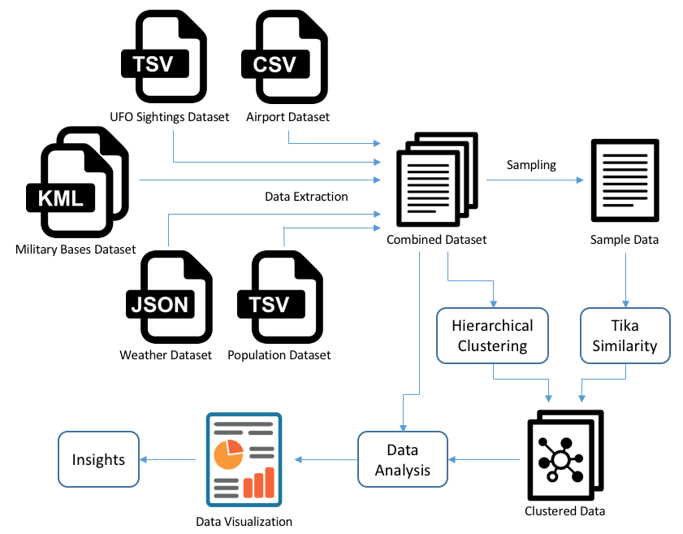
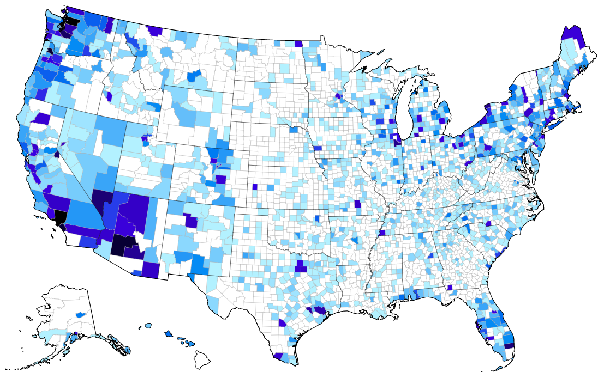
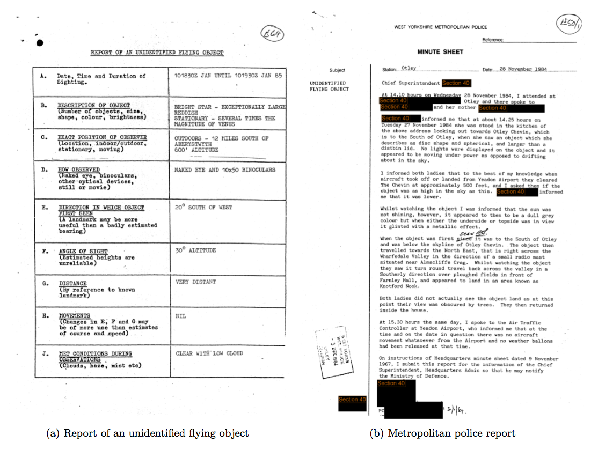
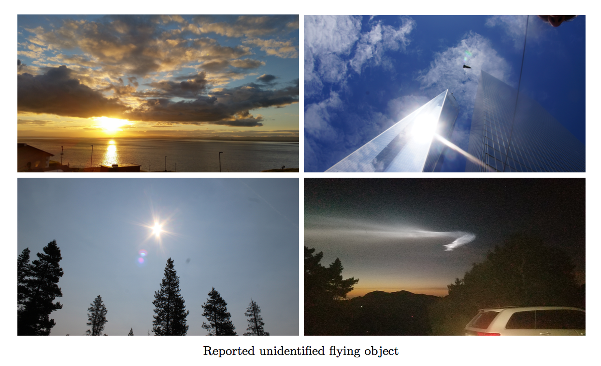
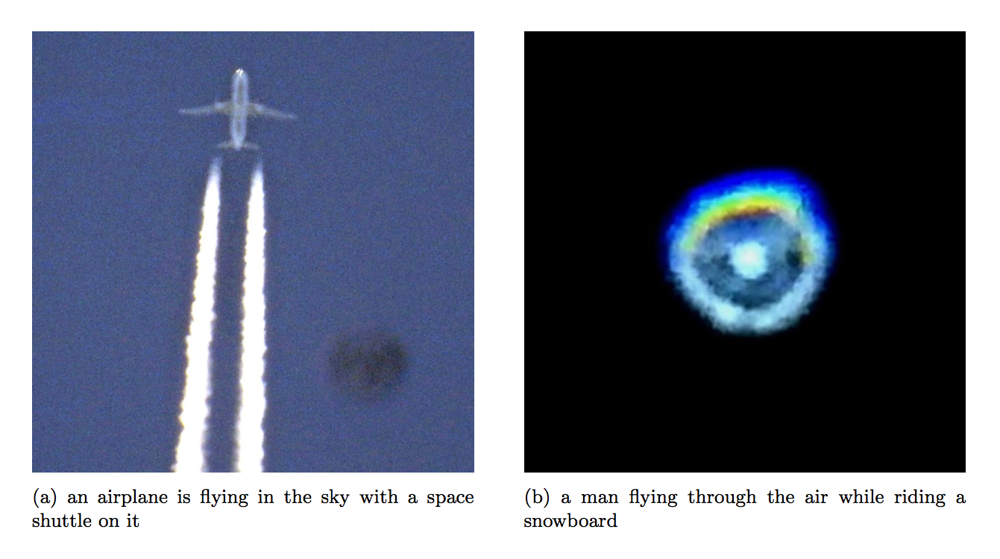
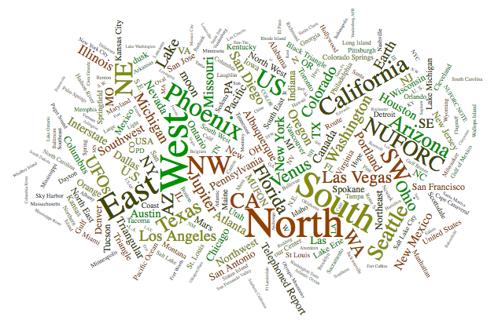
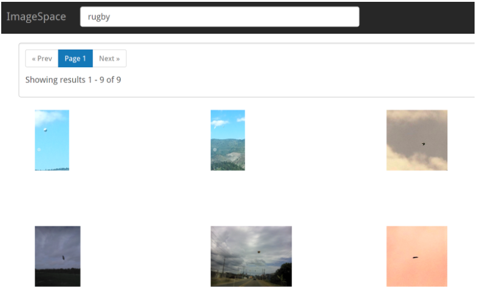

# Analysis of UFO Sightings Data

A research on unidentified flying objects (UFO) sightings data, analyzing reports, visual records, physical evidence, and other phenomena related to UFO.

## Overview

This research divided into 3 major module, each try to handle different problem using different approach.

* [Analysis of Structured UFO Sightings Data](#1)
* [Analysis of Unstructured UFO Sightings Data](#2)
* [Creating UFO Data Insights](#3)

## Analysis of Structured UFO Sightings Data

In this research, we explore several aspect of UFO sightings data using various tools and application including data extraction tool like [Apache Tika](https://tika.apache.org) and utilize similarity metrics by [Tika-Similarity](https://github.com/chrismattmann/tika-similarity) also apply some machine learning technique using [Numpy](http://www.numpy.org), [SciPy](https://www.scipy.org), [Scikit-learn](http://scikit-learn.org/stable) and [Pandas](https://pandas.pydata.org) library. Additionally, visualizing the data using framework like [D3.js](https://d3js.org) and [Matplotlib](https://matplotlib.org). Moreover, incorporate with some publicly available datasets to infer some potential insights.

### Process Diagram

### UFO Sightings Density

### Resources

* [Analytical Report](report/Analysis-of-Structured-UFO-Sightings-Data.pdf) - Analysis of Structured UFO Sightings Data Documentation

## Analysis of Unstructured UFO Sightings Data

In this section, we explore and analyze some different form of UFO sightings data which are portable document format (.pdf) and image file format that is a rather more complex data type to handle. Specifically, implement large scale OCR extraction, image captioning, object recognition and enrichment of UFO sightings data using several tools and framework including [ImageMagick](https://www.imagemagick.org), [Poppler](https://poppler.freedesktop.org), [Tesseract](https://wiki.apache.org/tika/TikaOCR), [Tika Parser](https://tika.apache.org/1.1/parser.html), [Tika Dockers](https://github.com/USCDataScience/tika-dockers), [TikaAndVision](https://wiki.apache.org/tika/TikaAndVision), [Tika ImageCaption](https://wiki.apache.org/tika/ImageCaption), [Selenium](http://selenium-python.readthedocs.io), [TikaNER](https://wiki.apache.org/tika/TikaAndNER), [OpenNLP](https://opennlp.apache.org), [CoreNLP](https://stanfordnlp.github.io/CoreNLP), [NLTK](https://www.nltk.org), [MITIE](https://github.com/mit-nlp/MITIE) and [Grobid Quantities](https://github.com/kermitt2/grobid-quantities). Finally, convert and aggregate it with a pre-process UFO sightings data to answer the question previously unanswered.

We implement some technique to extract useful information from unstructured dataset including:

* Large Scale OCR Extraction
* Image Captioning
* Object Recognition
* Enrichment of UFO Sightings Data

### UFO Sighting Reports

### Reported UFO Images

### Image Captioning Results

### Resources

* [Analytical Report](report/Analysis of Unstructured UFO Sightings Data.pdf) - Analysis of Unstructured UFO Sightings Data Documentation

## Creating UFO Data Insights

In this module, we try to apprehend the UFO sighting data using several visualization techniques to analyze and produce some helpful insights. Moreover, we ingest the UFO sighting data to [Apache Solr](http://lucene.apache.org/solr) to display a dynamic visualization on the web. Also, we use [ImageCat](https://github.com/chrismattmann/imagecat) and our custom scripts to use [Apache Tika](https://tika.apache.org) to extract metadata and provide OCR to get the image content into [Apache Solr](http://lucene.apache.org/solr). Finally, we connect [ImageSpace](http://github.com/nasa-jpl-memex/image_space) to Solr, and use [FLANN](https://www.cs.ubc.ca/research/flann) plugin to find similar images and search the image forensics and OCR. In addition, we integrate [ImageSpace](http://github.com/nasa-jpl-memex/image_space) with [ElasticSearch](https://www.elastic.co) and try some other plugins such as [SMQTK](http://github.com/kitware/SMQTK) and [VideoSpace](https://github.com/nasa-jpl-memex/image_space/tree/master/videospace).

### NER Location Word Cloud

### ImageSpace Query

### Resources

* [Analytical Report](report/Creating UFO Data Insights.pdf) - Creating UFO Data Insights Documentation

## Developers

* **Soravis Taekasem** - taekasem@usc.edu
* **Surasit Prakunhungsit** - prakunhu@usc.edu
* **Theerapat Chawannakul** - tchawann@usc.edu
* **Yifan Wu** - ywu352@usc.edu

## Data Sources

* Structured data sources
	* [Infochimps.org](http://www.infochimps.com) - UFO Sightings Datasets
	* [AcckiyGerman](https://github.com/datasets/airport-codes) - Airport Datasets
	* [U.S. Department of Transportation](https://osav-usdot.opendata.arcgis.com) - Military Bases Datasets
	* [National Centers for Environmental Information](https://www.ncdc.noaa.gov) - Weather Datasets
	* [United States Census Bureau](https://www.census.gov/programs-surveys/popest/data/data-sets.html) - National Population Datasets

* Unstructured data sources
	* [British Ministry of Defence](http://www.theblackvault.com/documentarchive) - British UFO Sightings Portable Document Formats
	* [UFO Stalker](http://www.ufostalker.com/tag/photo) - UFO Sightings Images